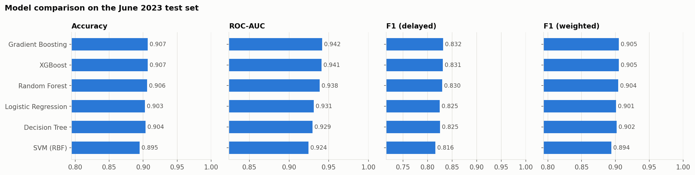
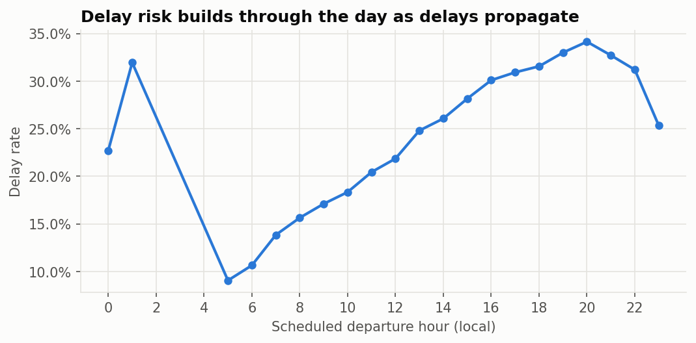
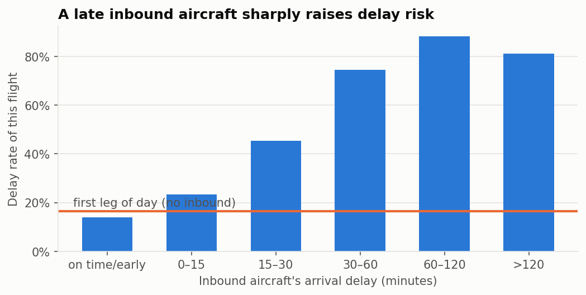
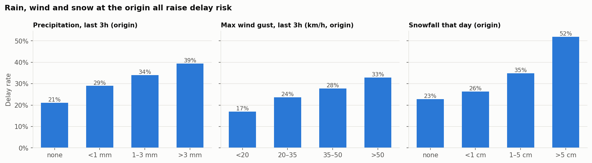
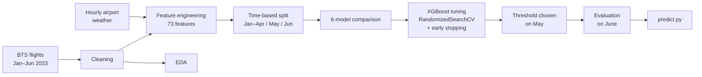
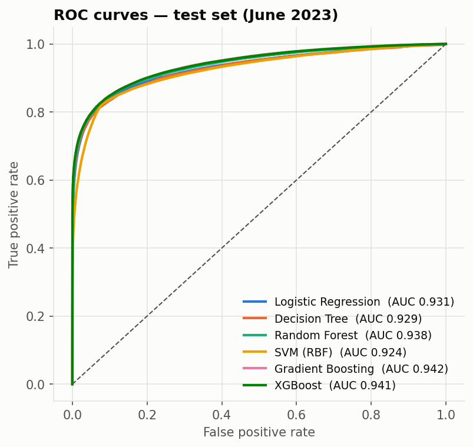
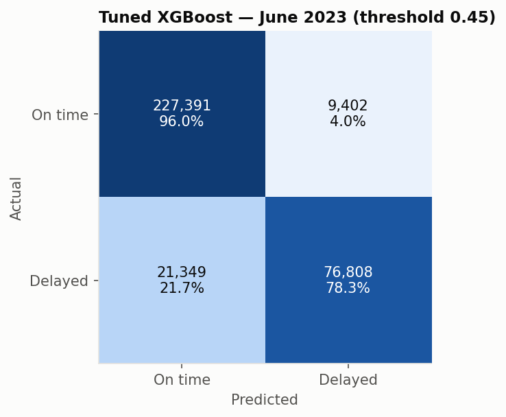
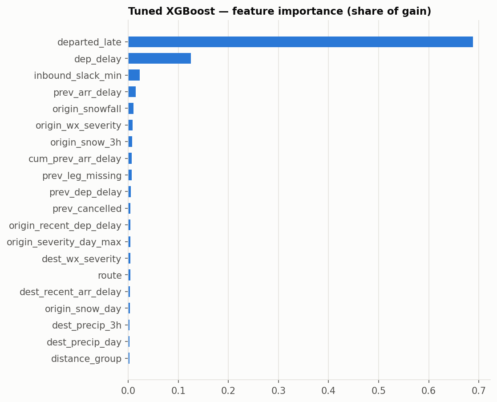
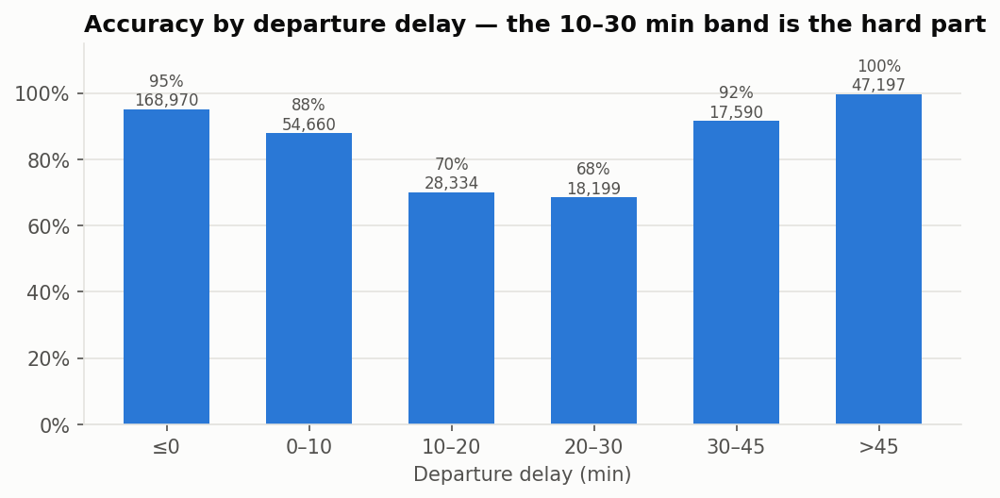

# ✈️ Flight Delay Prediction & Analytics Platform


An end-to-end machine-learning pipeline that predicts whether a US domestic flight will **arrive 15+ minutes
late**. It is built on **~2 million real flights** (BTS On-Time Performance, Jan–Jun 2023) joined with
**hourly airport weather** (Open-Meteo / ERA5).

The pipeline covers data acquisition, cleaning, EDA, feature engineering (time, route, weather and
aircraft-rotation features), a six-model comparison, hyperparameter tuning, and evaluation on a held-out month.

**Tech stack:** Python · Pandas · NumPy · Scikit-learn · XGBoost · Matplotlib / Seaborn · Jupyter · pytest

---

## 🏆 Results at a glance

Tuned XGBoost on **June 2023**: 334,950 flights the model never saw during training or tuning.

| Metric | Score |
|---|---|
| **Accuracy** | **90.8%** |
| **ROC-AUC** | **0.943** |
| **Macro-F1** | **0.885** |
| F1 (delayed class) | 0.833 |
| Precision / Recall (delayed) | 0.891 / 0.783 |
| PR-AUC | 0.918 |
| Baseline: always predict "on time" | 70.7% accuracy |

<p align="center">
  
</p>

---

## 🔍 Key findings from the EDA

- **23.3% of flights arrive 15+ minutes late**, but the rate drifts by month: 19.2% in May, 29.3% in June.
- **Delays build through the day.** The delay rate is 9.1% for 5 a.m. departures and 34.1% for 8 p.m. departures.
- **Delays propagate through the aircraft's rotation.** If the inbound aircraft arrived 30–60 minutes late,
  74% of next flights are delayed.
- **Weather matters on bad days.** More than 5 cm of snow at the origin lifts the delay rate from 23% to 52%.
  Gusts above 50 km/h lift it to 33%.
- **System-wide shocks dominate some days.** On 11 Jan 2023, the day of the nationwide FAA NOTAM outage,
  65.8% of flights were delayed.

<p align="center">
  
  
</p>
<p align="center">
  
</p>

All charts are in [`notebooks/01_eda.ipynb`](notebooks/01_eda.ipynb).

---

## 🎯 Problem framing

| | |
|---|---|
| **Task** | Binary classification: will the flight arrive late? |
| **Target** | `IS_DELAYED` = arrival delay ≥ 15 min (the US DOT definition of a delayed flight) |
| **Prediction point** | The moment the flight **pushes back from the gate**. Its departure delay is known then, but the arrival outcome is not. At that point an airline ops centre re-plans gates, crews and passenger connections at the destination. |
| **Split** | Time-based: train on **Jan–Apr**, validate on **May** (tuning and threshold), test on **June**. A random split would leak same-day weather and congestion between train and test. |
| **Harder variant** | `--prediction-point pre_departure` removes the flight's own departure delay and predicts from schedule, weather, inbound-aircraft and airport-state information only. |

---

## 📦 Data

| Source | What | Size |
|---|---|---|
| [BTS Reporting Carrier On-Time Performance](https://www.transtats.bts.gov/) | Every domestic flight by US carriers, Jan–Jun 2023 | 3,340,569 flights |
| [Open-Meteo historical archive](https://open-meteo.com/en/docs/historical-weather-api) | Hourly temperature, humidity, precipitation, snowfall, cloud cover, wind, gusts and WMO weather code for each airport, in local time | 217,200 airport-hours |
| [OurAirports](https://ourairports.com/data/) | Airport coordinates for the weather lookup | — |

Scope is flights between the **50 busiest airports** (60% of all traffic), which leaves **1,977,481 flights**
after cleaning. Nothing is committed to the repo: the download scripts fetch everything.

---

## 🔧 Pipeline



| Step | Module | Output |
|---|---|---|
| Download flights | `src/data/download_flights.py` | `data/raw/flights_2023_MM.parquet` |
| Download weather | `src/data/download_weather.py` | `data/raw/weather_hourly.parquet` |
| Clean + target | `src/preprocessing.py` | `data/processed/flights_clean.parquet` |
| Features | `src/features.py`, `src/build_features.py` | `data/processed/features.parquet` |
| EDA | `notebooks/01_eda.ipynb` | `reports/figures/*` |
| Model comparison | `src/train.py` | `reports/model_comparison_*.csv` |
| Tuning + final model | `src/tune.py` | `reports/final_metrics_*.json`, `models/*.joblib` |
| Error analysis | `notebooks/02_modeling.ipynb` | — |
| Prediction | `src/predict.py` | probabilities per flight |

### Cleaning
- Keep flights where both endpoints are among the top-50 airports.
- Drop cancelled and diverted flights (they have no arrival delay).
- Drop rows missing delay values or the tail number, plus duplicates.
- Drop non-positive scheduled durations and arrivals more than 2 hours early.
- Convert `hhmm` clock times to minutes after midnight (BTS writes midnight as `2400`).

### Feature engineering (73 features)

| Group | Examples | Why |
|---|---|---|
| **Time** | hour and day of week as cyclical sin/cos, part of day, month, day of year, weekend flag, days to the nearest federal holiday | Delays accumulate through the day; seasonal and holiday peaks |
| **Route & congestion** | carrier, origin, destination, route, distance, scheduled block time, scheduled speed (schedule padding), flights per hour at origin and destination | Baseline risk of each airport and route, plus congestion |
| **Aircraft rotation** | inbound leg's arrival and departure delay, scheduled turnaround, **inbound slack** (turnaround minus inbound delay), aircraft's cumulative delay so far that day, leg number | Delay propagates through the aircraft's daily rotation |
| **Airport state** | mean departure delay and share of late departures at the origin over the previous 2 hours; recent arrival delay at the destination | Ground stops and congestion: the equivalent of the FAA airport status board |
| **Weather** | origin weather at the departure hour and destination weather at the arrival hour; 3-hour rolling precipitation, snow and max gust; daily totals; WMO code mapped to a 0–6 severity scale | Rain, wind, snow and thunderstorms cut airport capacity |
| **Departure** | departure delay, departed-late flag | Known at pushback (omitted in the pre-departure variant) |

- Rotation features are computed on the **full** BTS file, before the top-50 filter, so inbound legs from
  smaller airports are not lost.
- Airport-state features use only **strictly earlier** hours.
- Both behaviours are covered by unit tests.

---

## 🤖 Models

Each model is an sklearn `Pipeline`:
- linear and kernel models get one-hot encoding plus `StandardScaler`;
- tree models get ordinal encoding;
- the tuned XGBoost uses native categorical support.

Each model's decision threshold is the one that maximises F1 on May, applied unchanged to June.

**Test set: June 2023, before tuning**

| Model | Accuracy | ROC-AUC | Macro-F1 | F1 (delayed) | Train rows |
|---|---|---|---|---|---|
| Gradient Boosting (`HistGradientBoostingClassifier`) | 90.7% | 0.942 | 0.884 | 0.832 | 400k |
| XGBoost | 90.7% | 0.941 | 0.883 | 0.831 | 400k |
| Random Forest | 90.6% | 0.938 | 0.882 | 0.830 | 400k |
| Logistic Regression | 90.3% | 0.931 | 0.879 | 0.825 | 400k |
| Decision Tree | 90.4% | 0.929 | 0.879 | 0.825 | 400k |
| SVM (RBF) | 89.5% | 0.924 | 0.871 | 0.816 | 30k* |
| **XGBoost, tuned (full training data)** | **90.8%** | **0.943** | **0.885** | **0.833** | **1.29M** |

\* Kernel SVMs scale roughly quadratically with training size, so the SVM was trained on a 30k stratified sample.

**Reading the results:**
- Boosted trees win.
- Logistic Regression comes surprisingly close, because departure delay is a strong, nearly linear signal.
- The tree models earn their advantage on flights that leave **10–30 minutes late**, where the outcome
  depends on route padding, destination congestion and weather.

<p align="center">
  
  
</p>

### Hyperparameter tuning
- **Search:** `RandomizedSearchCV` with 30 configurations over 10 XGBoost hyperparameters: depth, learning
  rate, number of trees, min child weight, subsample, column sample, gamma, L1/L2 regularisation and
  categorical handling.
- **Validation:** a **`PredefinedSplit`** fits on a Jan–Apr sample and scores ROC-AUC on May, so tuning
  respects time order.
- **Final model:** the best configuration is refit on all 1.29M training flights, with **early stopping** on
  May choosing the number of trees.

| Hyperparameter | Value |
|---|---|
| `max_depth` | 10 |
| `learning_rate` | 0.037 |
| `min_child_weight` | 33 |
| `subsample` / `colsample_bytree` | 0.87 / 0.41 |
| `gamma` / `reg_lambda` / `reg_alpha` | 2.56 / 8.46 / 0.082 |
| Trees (early stopping) | 1,010 |

The search chose deep trees for interactions but made them conservative: slow learning, large leaves,
gamma, L2 and feature subsampling. Full results are in
[`reports/tuning_results_departure.csv`](reports/tuning_results_departure.csv).

<p align="center">
  
</p>

### Where the model struggles

Accuracy depends heavily on how late the flight leaves:
- **Easy cases:** 95% accuracy for on-time departures and nearly 100% for departures 45+ minutes late.
- **Hard band:** flights that leave **10–30 minutes late** (48,872 June flights, 41% of them arrive late).
  Whether they arrive late depends on schedule padding, destination congestion and weather.

In the hard band:
- the simple rule *"departed 15+ min late ⇒ arrives late"* gets **60.2%** accuracy;
- the tuned model gets **70.0%** (ROC-AUC 0.756).

That band is where the engineered features earn their keep.

<p align="center">
  
</p>

Predicted probabilities are close to calibrated: the mean predicted probability on June is 0.287, against an
actual delay rate of 0.293. Full analysis is in [`notebooks/02_modeling.ipynb`](notebooks/02_modeling.ipynb).

### The harder variant: predicting before departure

Without the flight's own departure delay, the task is substantially harder. Here the gap between linear and
tree models widens, because the remaining signal (propagation, congestion, weather) is non-linear.

**Test set: June 2023, before tuning, pre-departure**

| Model | Accuracy | ROC-AUC | Macro-F1 |
|---|---|---|---|
| Gradient Boosting | 80.3% | 0.833 | 0.759 |
| XGBoost | 80.7% | 0.829 | 0.759 |
| Random Forest | 77.6% | 0.823 | 0.739 |
| Decision Tree | 78.2% | 0.796 | 0.732 |
| Logistic Regression | 75.3% | 0.786 | 0.711 |
| SVM (RBF) | 76.5% | 0.778 | 0.721 |
| **XGBoost, tuned (full training data)** | **80.7%** | **0.837** | **0.763** |

---

## 🚀 Reproduce

```bash
pip install -r requirements.txt

make data       # download BTS flights (~160 MB) and airport weather
make features   # clean + build the feature table
make eda        # execute notebooks/01_eda.ipynb
make train      # 6-model comparison (both prediction points)
make tune       # randomized search + final XGBoost (both prediction points)
make test       # unit tests
```

Without `make`, run the modules directly, e.g. `python -m src.train --prediction-point departure`.
Random seeds are fixed (`random_state=42`).

Score flights with the tuned model:

```bash
python -m src.predict --date 2023-06-15 --origin ORD
```

```
flight_date carrier  flight_number origin dest  crs_dep_time  delay_probability  predicted_delayed  actual_delayed
 2023-06-15      AA            760    ORD  DFW           500              0.024                  0               0
 2023-06-15      NK              7    ORD  FLL           500              0.020                  0               0
 2023-06-15      UA           1218    ORD  DEN           500              0.036                  0               0
 2023-06-15      DL           1248    ORD  LGA           600              1.000                  1               1
 ...
```

### Tests

```bash
python -m pytest -q tests
```

The tests cover:
- `hhmm` time conversion, including midnight;
- cleaning rules and the 15-minute target;
- aircraft-rotation features: previous-leg delay, turnaround and inbound slack;
- the red-eye weather join, where the flight lands the next calendar day;
- no look-ahead in the airport-state features;
- the evaluation metrics and threshold selection.

---

## 📁 Project structure

```
├── notebooks/
│   ├── 01_eda.ipynb            exploratory data analysis
│   └── 02_modeling.ipynb       model comparison, tuning results, error analysis
├── reports/
│   ├── figures/                all plots
│   ├── model_comparison_*.csv  six-model comparison per prediction point
│   ├── tuning_results_*.csv    every configuration tried
│   └── final_metrics_*.json    tuned-model metrics
├── src/
│   ├── config.py               paths, scope, split, prediction point
│   ├── data/                   downloaders + airport lookup
│   ├── preprocessing.py        cleaning + target
│   ├── features.py             feature engineering
│   ├── build_features.py       feature table builder
│   ├── dataset.py              time-based splits
│   ├── models.py               model zoo
│   ├── evaluate.py             metrics + plots
│   ├── train.py                model comparison
│   ├── tune.py                 hyperparameter search + final model
│   └── predict.py              prediction CLI
├── tests/                      pytest unit tests
├── Makefile
└── requirements.txt
```

---

## ⚠️ Limitations

- **Weather is observed, not forecast.** The project uses ERA5 reanalysis as a stand-in for the forecast an
  operator would have, so destination weather and daily totals are slightly optimistic.
- **Airport-state features group flights by scheduled hour.** A still-waiting flight therefore contributes its
  eventual delay a little early. A live system would use actual departure timestamps.
- **Base rates drift by season.** June was 29% delayed against 23% in training, so a production model needs
  periodic retraining or recalibration.
- **Scope is limited** to the top-50 US airports and the first half of 2023.

## 🔭 Future work

- Archived weather **forecasts** instead of observations
- **Walk-forward validation** across several months
- **SHAP** explanations for each prediction
- A **REST API** (FastAPI) with live flight-status and weather feeds, plus drift monitoring
- Regression on delay **minutes** alongside the classifier

## License

MIT — see [LICENSE](LICENSE).
